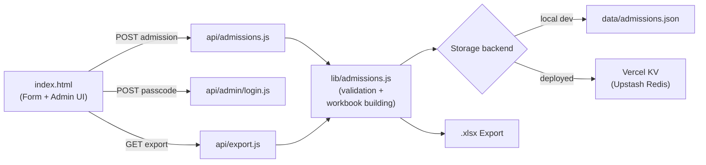

<div align="center">

# CIR Admissions

**A single-page admission form for CIR's GRE / TOEFL / IELTS exam-prep course.**

Students submit their details through a polished landing page — admins log in with a passcode to review submissions and export everything as a real `.xlsx` file.

[](https://nodejs.org)
[](https://vercel.com)
[](https://vercel.com/docs/storage/vercel-kv)
[](https://github.com/exceljs/exceljs)

</div>

---

## Features

| Feature | Description |
|---|---|
| **Admission Form** | Name, register number, department, year, program track + consent checkbox |
| **Confirm-Before-Submit Modal** | Students confirm fee terms before the record is actually saved |
| **Passcode-Gated Admin Panel** | Simple passcode check unlocks the count of admissions and the export button |
| **Excel Export** | One-click `.xlsx` download with formatted dates, bold headers, fixed column widths |
| **Dual Storage Backend** | Local JSON file for dev, Vercel KV (Upstash Redis) in production — same code path |
| **Zero-Setup Local Dev** | Plain Express server, no Vercel account or Redis credentials required to try it out |

---

## Architecture



`lib/admissions.js` is shared by the deployed `api/*.js` functions and the local
`dev-server.js`, so local testing and production behave identically — only the storage
backend differs.

---

## Tech Stack

- **Frontend**: Static HTML/CSS/JS (`index.html`) — no build step
- **Backend**: [Vercel serverless functions](https://vercel.com/docs/functions) (`api/`)
- **Local Dev Server**: [Express](https://expressjs.com/)
- **Storage**: [Vercel KV](https://vercel.com/docs/storage/vercel-kv) (Upstash Redis) in production, JSON file locally
- **Excel Export**: [ExcelJS](https://github.com/exceljs/exceljs)
- **Hosting**: [Vercel](https://vercel.com)

---

## Quick Start

### Prerequisites

- Node.js ≥ 18
- No Vercel account or Redis credentials needed for local dev

### Installation

```bash
git clone <this-repo-url>
cd Cir

npm install
```

### Run

```bash
npm start
```

The app opens at **http://localhost:3000**. The admin passcode is printed in the terminal
on startup (falls back to a default baked into the code unless you set `ADMIN_PASSCODE`).

---

## Project Structure

```
Cir/
├── index.html            # Static frontend — hero, admission form, confirmation modal, admin UI
├── lib/
│   └── admissions.js     # Shared logic: field validation + Excel-workbook building
├── api/
│   ├── admissions.js     # POST submit an admission / GET list (admin) — Vercel serverless function
│   ├── admin/
│   │   └── login.js      # POST passcode check — Vercel serverless function
│   └── export.js         # GET .xlsx export (admin) — Vercel serverless function
├── data/
│   └── admissions.json   # Local storage (git-ignored)
├── dev-server.js         # Plain local Express server for testing without Vercel/Upstash
└── package.json
```

---

## Usage

1. Fill out and submit the admission form → confirm in the pre-submit modal → success message
2. Click **Admin login** (top right) and enter the passcode
3. Check the admission count and click **Download Excel** to export everything

---

## Admission Form Fields

- Name, Register Number, Department, Year of Study, Interested Program Track — required
- Consent checkbox
- Submitting opens a confirmation modal (states that confirming means agreeing to pay the
  program's course/admission fees, with further details to follow by email) before anything
  is saved — only "Confirm admission" there actually writes the record

## Admin Panel

- **Download Excel** — generates a `.xlsx` with columns S.No, Name, Register Number,
  Department, Year, Program Track, Consent, Submitted At (formatted, e.g.
  `20 Aug 2026, 8:30 PM`), fixed generous column widths, bold + wrapped header row
- **Log out** clears the session client-side; there's no persistent admin session

---

## Environment Variables

| Variable | Required | Description |
|---|---|---|
| `ADMIN_PASSCODE` | Recommended | Passcode for the admin panel. Falls back to a default baked into the code if unset — do not rely on the default for a real deployment |
| `KV_REST_API_URL` | Production only | Auto-injected by Vercel when you attach an Upstash Redis (Vercel KV) database |
| `KV_REST_API_TOKEN` | Production only | Auto-injected alongside `KV_REST_API_URL` |

---

## Storage

- **Local (`npm start`)** — admissions are written to `data/admissions.json` (git-ignored).
  This is only for trying the app out on your machine; it is not shared or persistent in
  any real sense.
- **Deployed (Vercel)** — `api/*.js` use [`@vercel/kv`](https://vercel.com/docs/storage/vercel-kv)
  (backed by Upstash Redis) so every visitor's submission lands in one shared, central store
  that the admin panel reads from, regardless of who submitted it or from which browser.

---

## Deploying to Vercel

1. **Link the project**
   ```bash
   npx vercel login
   npx vercel link
   ```

2. **Add Redis storage** — in the Vercel dashboard, go to your project's **Storage** tab →
   **Create Database** → pick **Upstash for Redis** (free tier is enough for this app) →
   attach it to the project. This auto-injects `KV_REST_API_URL` and `KV_REST_API_TOKEN`
   into the project's environment variables, which `@vercel/kv` reads automatically.

3. **Set a real admin passcode** — project **Settings → Environment Variables** → add
   `ADMIN_PASSCODE` with a strong value of your own. Otherwise it falls back to the default
   passcode hardcoded in the source, which you should not rely on for a real deployment.

4. **(Optional) test against the deployed stack locally**
   ```bash
   npx vercel env pull .env.local
   npx vercel dev
   ```

5. **Deploy**
   ```bash
   npx vercel          # preview deployment
   npx vercel --prod   # production
   ```

### Deploying via GitHub instead

Push this repo to GitHub, then in the Vercel dashboard go to **Settings → Git → Connect Git
Repository** and pick it. Every push to the default branch then auto-deploys, and every PR
gets its own preview URL. The env vars from steps 2–3 above stay attached to the Vercel
project either way.

---

## Security Notes — read before a real deployment

The admin passcode check (`api/admin/login.js`, and the `X-Admin-Passcode` header check in
`api/admissions.js` / `api/export.js`) is a **plaintext string comparison on the server**.
It is *not* real authentication: no hashing, no sessions/JWTs, no rate limiting, no audit
log. This is fine for a low-stakes prototype gathering a few hundred admissions, but a
production deployment handling real student data should use proper server-side
authenticated auth (hashed credentials, session/JWT) and a real database (Postgres/MySQL/
etc.) rather than a shared passcode and a Redis list.

## Known Dependency Notes

- `exceljs` pulls in a transitive `uuid` package flagged for a moderate-severity advisory
  (a buffer bounds check issue) in a code path this app doesn't exercise with
  attacker-controlled input. Worth knowing, not currently blocking.

---

<div align="center">
<sub>Built with Node.js, Express, ExcelJS & Vercel KV</sub>
</div>
